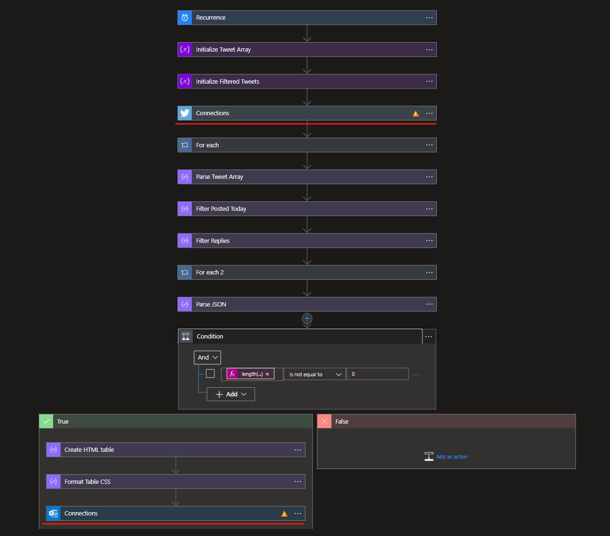
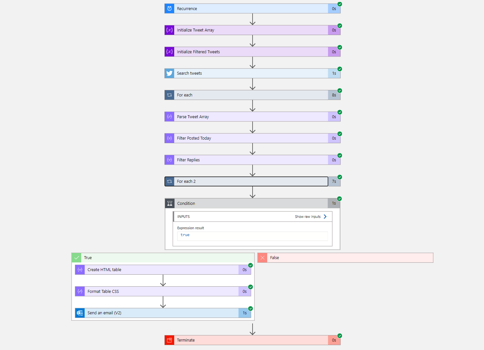

# Schedule-TwitterAggregation

Sentinel Playbook to Aggregate Twitter Posts

1. Deploy from a custom template.
2. Load `azuredeploy.json`.
3. Enter value for Email Recipients
4. Enter value for Maximum Returned Twitter Results (Integer)
5. Enter value for TwitterUser, example @noodlemctwoodle
6. Deploy Resource.
7. Once you application has deployed to will need to auithenticate against your Twitter account and an Office 365 Mailbox.
    
8. The playbook runs every night and collects the data from the previous day

